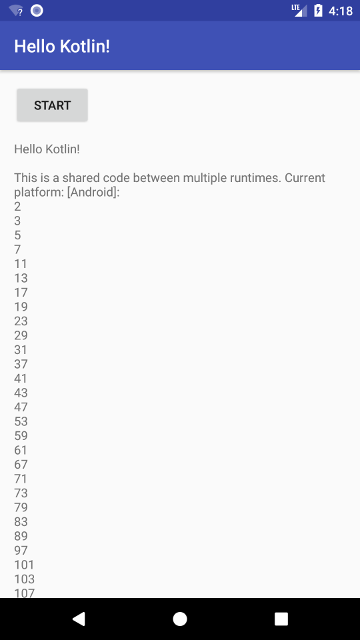
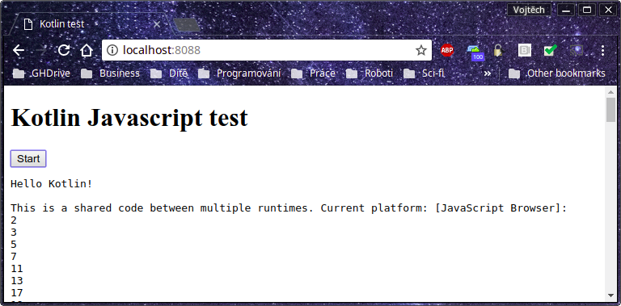
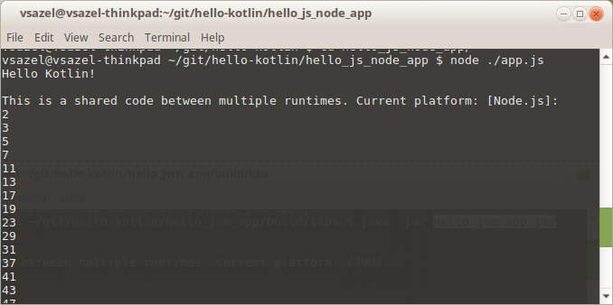

# Multiplatform Kotlin Hello World

This project demonstrates sharing runtime independent code between different Kotlin's runtimes ([Java](http://www.java.com)/[Android](https://developer.android.com/index.html)/[JavaScript](https://en.wikipedia.org/wiki/JavaScript)). It uses [Gradle](http://gradle.org/) build engine.

## What is Kotlin?
[
otlin](http://kotlinlang.org) is a programming language developed by [Jetbrains](https://www.jetbrains.com/). It's fully compatibile with [Java](http://www.java.com) runtimes and also there is support for [JavaScript](https://en.wikipedia.org/wiki/JavaScript) transpilation. Experimental version of [Kotlin/Native](https://kotlinlang.org/docs/reference/native-overview.html) has goal to also build fully native apps for iOS, Linux, Windows and possibly other platforms.

## What is it doing?
* writes Hello Kotlin!
* calculates first 1000 prime numbers (this part is shared between runtimes) and prints them

## Structure
It's gradle multiple modules project. 

* ``hello_android_app`` - Android application module, it's compiled to DEX bytecode, it produces APK file upon build
* ``hello_js_browser_app`` - application transpilled for frontend JavaScript, packed in [WebPack](https://webpack.js.org/), it's only statically served by Node.js
* ``hello_js_node_app`` - console application transpilled to Node.js JavaScript
* ``hello_jvm_app`` - console application compiled to Java bytecode for JVM, produces JAR that can be executed by eg. Oracle JVM
* ``hello_lib_common`` - common module, shared Kotlin source code, platform independent code
* ``hello_lib_js`` - JavaScript runtimes platform dependent code
* ``hello_lib_jvm`` - Java runtime platform dependent code 

## Platform implementation specifics
* prime number calculation is platform independent, single code shared for all platforms 
* text output on screen is platform dependent 
** *Android* - it's done by adding with TextView to layout
** *Frontend JavaScript* - it adds element in DOM of HTML page
** *Node.js JavaScript* - uses `console.log()`
** *JVM* -  uses `System.out.println()`

_Note: Ordinary console output can be done by `println()` function from Kotlin Standard Library._

## Building and running the demo
It was checked only under Linux Mint, probably there won't be any problems with most Unix-like environments.

### Android application 
You can use Android Studio to run the application. To build from command line, you can use

    # ./gradlew hello_android_app:build

and APK file is located in your ``build/outputs/apk`` directory.

    
### JVM console application

    # ./gradlew hello_jvm_app:build

You can than run the JAR file using `java -jar hello_jvm_app.jar` command from ``build/libs`` directory. 

### Frontend JavaScript application

    # ./gradlew hello_js_browser_app:build

Webpack allows to host site directly from Gradle by

    # ./gradlew hello_js_browser_app:run 
    
It will run locally on [http://localhost:8088/](http://localhost:8088/). 

### Node.js console application

    # ./gradlew hello_js_node_app:build

You can execute it `in hello_js_node_app` directory by:

    # node ./app.js

    
### to see all build options    
    
    # ./gradlew tasks --all
    
## License
Do whathever you want with this. 
