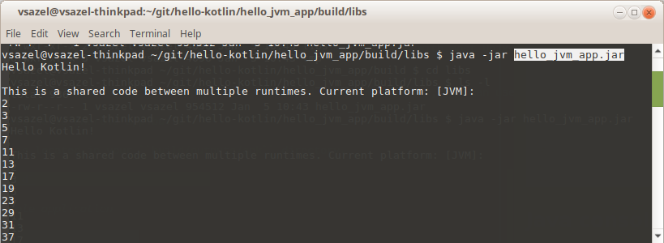

# Multiplatform Kotlin Hello World

This project demonstrates sharing runtime independent code between different Kotlin's runtimes ([Java](http://www.java.com)/[Android](https://developer.android.com/index.html)/[JavaScript](https://en.wikipedia.org/wiki/JavaScript)). It uses [Gradle](http://gradle.org/) build engine.

It uses new support for multiplatform modules with plugin `kotlin-multiplatform`.
* [Multiplatform library guide](https://kotlinlang.org/docs/tutorials/multiplatform-library.html) 

Applications are built using features available from **Kotlin 1.2** regarding multiplatform modules - see this blog posts:
* [Kotlin 1.2 Released: Sharing Code between Platforms](https://blog.jetbrains.com/kotlin/2017/11/kotlin-1-2-released/)
* [Webinar recording: Developing Multiplatform Projects in Kotlin 1.2](https://blog.jetbrains.com/kotlin/2017/12/webinar-recording-developing-multiplatform-projects-in-kotlin-1-2/)

Older implementation that didn't use `kotlin-multiplatform` plugin and various hacks was moved to [old-multiplatform](https://github.com/wojta/hello-kotlin/tree/old-platform-modules) branch.
Oldest implementation that used various hacks was moved to [old-multiplatform](https://github.com/wojta/hello-kotlin/tree/old-multiplatform) branch.

## What is Kotlin?
[
otlin](http://kotlinlang.org) is a programming language developed by [Jetbrains](https://www.jetbrains.com/). It's fully compatibile with [Java](http://www.java.com) runtimes and also there is support for [JavaScript](https://en.wikipedia.org/wiki/JavaScript) transpilation. Experimental version of [Kotlin/Native](https://kotlinlang.org/docs/reference/native-overview.html) has goal to also build fully native apps for iOS, Linux, Windows and possibly other platforms.

## What is it doing?
* writes Hello Kotlin!
* calculates first 1000 prime numbers (this part is shared between runtimes) and prints them

## Structure
It's the Gradle multiple modules project. 

* ``hello_android_app`` - Android application module, it's compiled to DEX bytecode, it produces APK file upon build
* ``hello_js_browser_app`` - application transpiled for frontend JavaScript, packed in [WebPack](https://webpack.js.org/), it's only statically served by Node.js
* ``hello_js_node_app`` - console application transpiled to Node.js JavaScript 
* ``hello_jvm_app`` - console application compiled to Java bytecode for JVM, produces JAR that can be executed by eg. Oracle JVM
* ``hello_lib`` - multiplatform library project, with shared and platform specific code
    * ``commonMain`` - shared Kotlin source code, platform independent code
    * ``commonTest`` - shared tests, platform independent tests
    * ``jsMain`` - JavaScript runtimes platform dependent code
    * ``jsTest`` - JavaScript runtimes specific tests
    * ``jvmMain`` - Java runtime platform dependent code
    * ``jvmTest`` - Java runtime specific tests 
    * ``androidMain`` - Android runtime platform dependent code
    * ``androidTest`` - Android runtime specific tests

[Modules dependency](.images/diagram_simple.png)

## Platform implementation specifics
* prime number calculation is platform independent, single code shared for all platforms 
* text output on screen is platform dependent 
    * **Android** - it's done by adding with TextView to layout
    * **Frontend JavaScript** - it adds element in DOM of HTML page
    * **Node.js JavaScript** - uses `console.log()`
    * **JVM** -  uses `System.out.println()`

_Note: Ordinary console output can be done by `println()` function from Kotlin Standard Library._

[Implementation in modules](.images/diagram_detailed.png)

## Building and running the demo
It was checked only under Linux Mint, probably there won't be any problems with most Unix-like environments.

### Android application 
You can use Android Studio to run the application. To build from command line, you can use

    # ./gradlew hello_android_app:build

and APK file is located in your ``build/outputs/apk`` directory.

    
### JVM console application

    # ./gradlew hello_jvm_app:build

You can than run the JAR file using `java -jar hello_jvm_app.jar` command from ``build/libs`` directory. 

### Frontend JavaScript application

    # ./gradlew hello_js_browser_app:build

Webpack allows to host site directly from Gradle by

    # ./gradlew hello_js_browser_app:run 
    
It will run locally on [http://localhost:8088/](http://localhost:8088/). 

### Node.js console application

    # ./gradlew hello_js_node_app:build

You can execute it `in hello_js_node_app` directory by:

    # node ./app.js

    
### to see all build options    
    
    # ./gradlew tasks --all
    
## License
Do whathever you want with this. 
